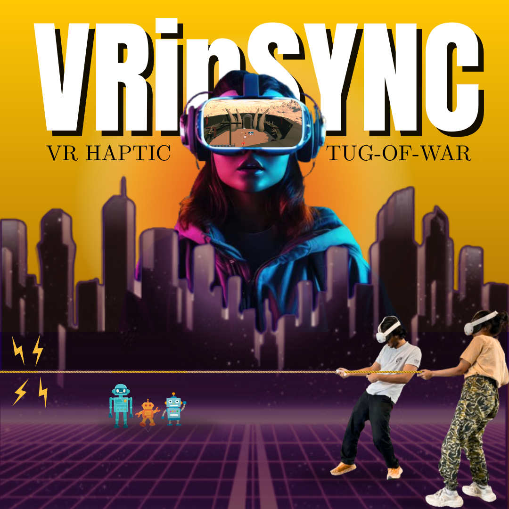
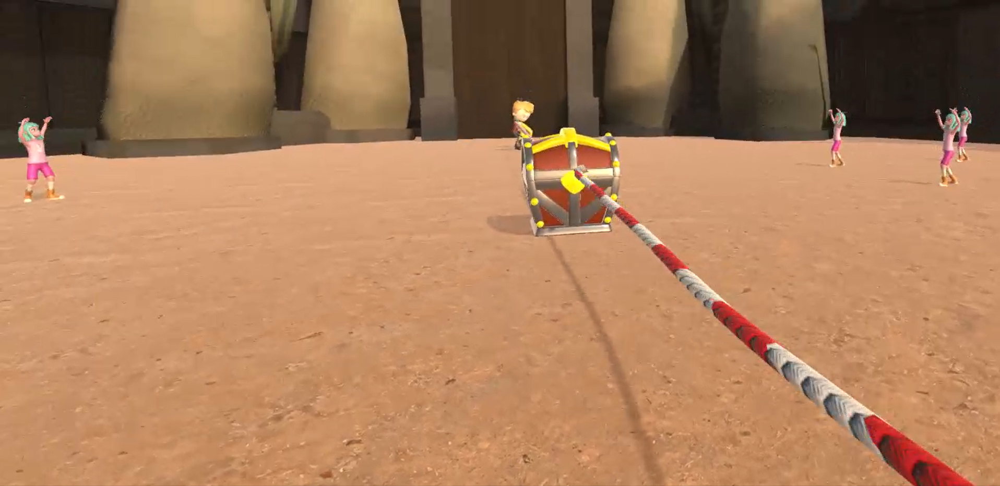
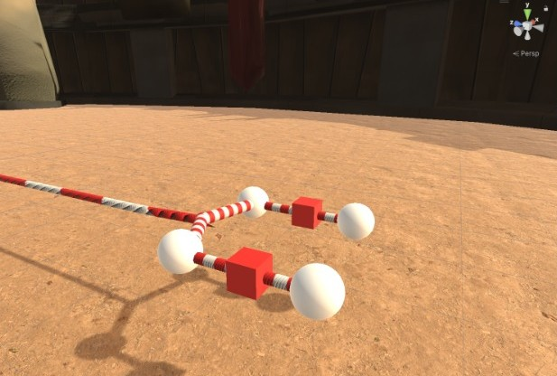
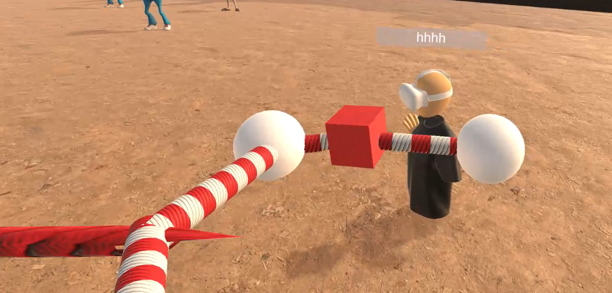

# VRinSync: Networked Motor Synchrony Research in Virtual Reality

**Collaborative VR Rope-Pulling Experiment : Exploring Audio/Haptic Pacing Cues & Network Latency Effects**

## Overview
This repository contains code, data, and resources for the VRinSync research project. We investigated how different pacing modalities (audio, haptic, both, none) and network latencies (0ms vs 400ms) affect synchrony, task performance, and user experience in a collaborative virtual reality (VR) rope-pulling game.

## Project Goals
- Measure effects of pacing feedback (audio, haptic, both, none)
- Quantify network delay impacts on VR collaboration
- Collect objective (performance logs)  and subjective data (survey responses) for robust analysis

## Experimental Design
- **Participants:** 8 pairs (16 individuals)
- **Game Task:** VR rope-pulling, 8 rounds per pair with varied conditions
- **Cues:** Audio, haptic, both, none
- **Latency:** 0ms and 400ms (Simulated via Clumsy tool)

## How It Works
- VR Setup: Unity multiplayer environment, customizable pacer systems (audio & haptic)
- Logging: Automated recording of performance metrics and questionnaire responses
- Data Analysis: Jupyter/Python scripts for merging data, analyzing results, and visualizing findings (boxplots, bar charts, learning curves)

## Key Findings
- Haptic feedback was rated most effective by participants for achieving synchrony
- Synchrony scores dipped slightly when latency was introduced but generally remained high
- Both pacing cues (audio + haptic) enabled the fastest task completion
- Most participants found tasks mentally and physically easy, with primary gaze focused on the partner

## Team

- **Contributors:** Kirti, Ruyue, Sanchi, Syed Ali
- **Supervision:** Laura Simon, Lina Klass, Anton Lammert

## Acknowledgments

Conducted as part of the MSc Human-Computer Interaction program. Special thanks to all participants and advisors.

## Presentation

View the full presentation on Canva: [VRinSync Final PPT](https://www.canva.com/design/DAGrRthTdt8/g_HlLvYk4KR2lHpbzrXUkw/view?utm_content=DAGrRthTdt8&utm_campaign=designshare&utm_medium=link2&utm_source=uniquelinks&utlId=h40c194867a)

